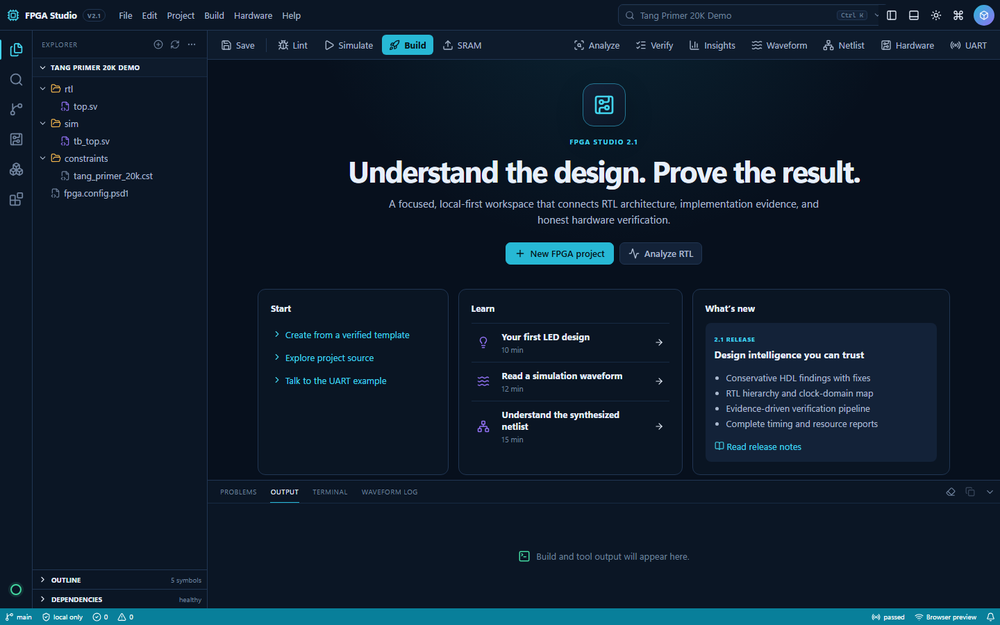
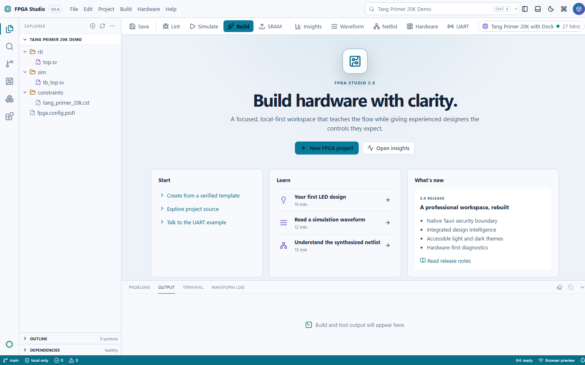
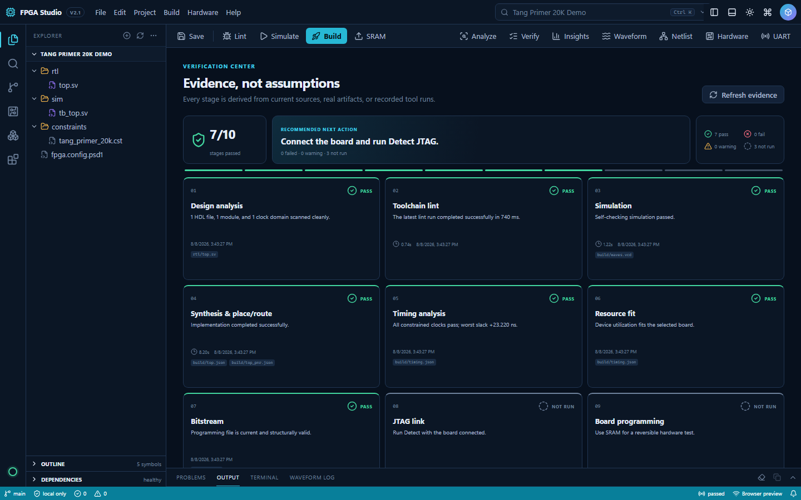
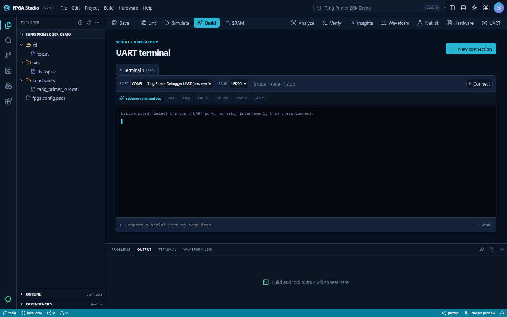
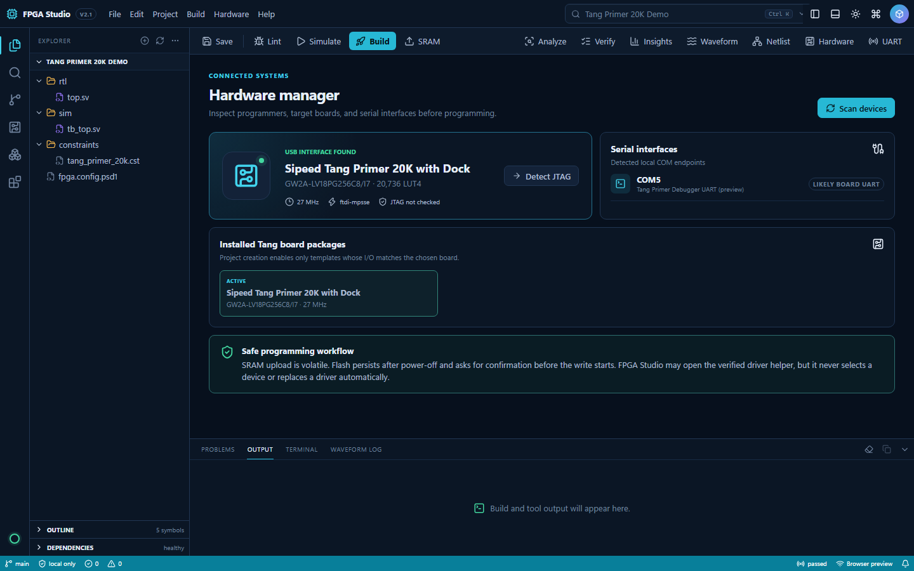
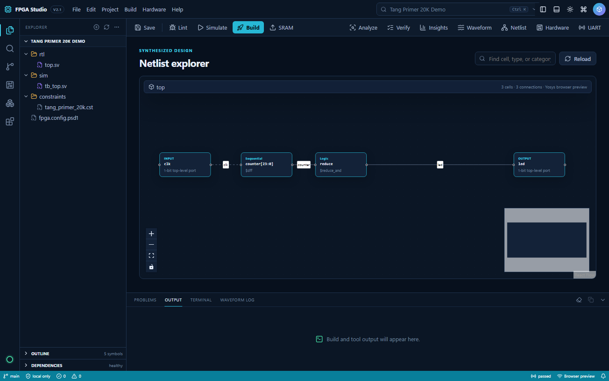
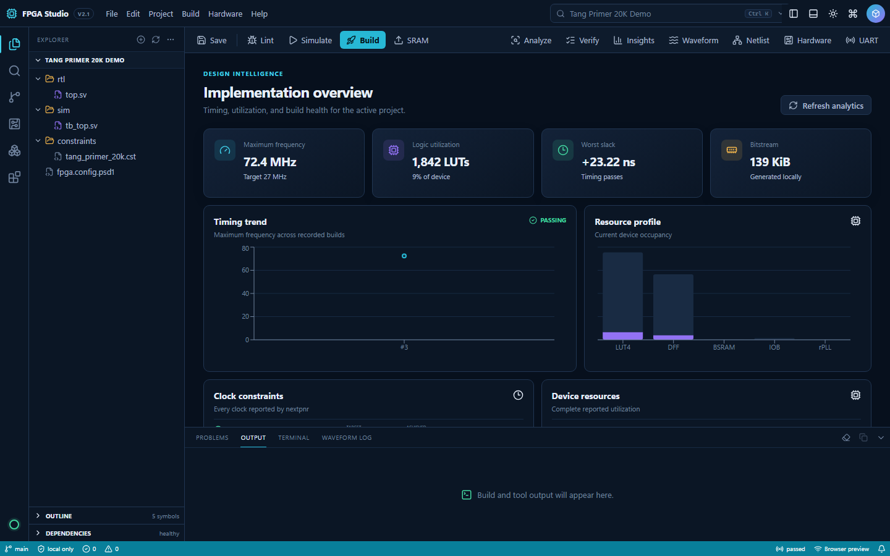
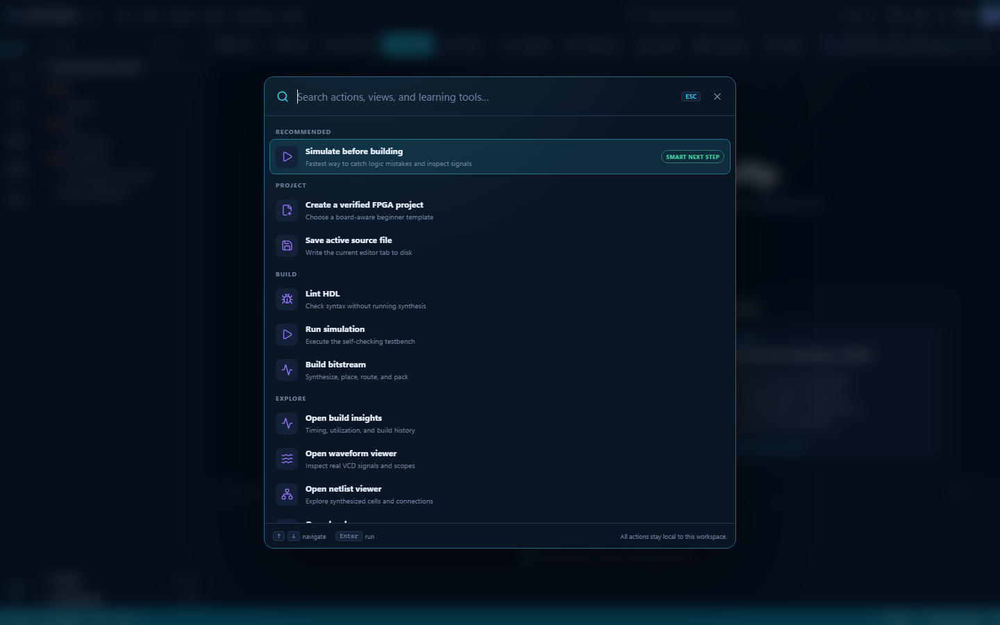

# Tang FPGA Studio

[](https://github.com/atmarachchige0081/Tang-FPGA-Studio/actions/workflows/quality-gates.yml)
[](LICENSE)
[](studio/)
[](CHANGELOG.md)

An open-source, beginner-friendly FPGA IDE and development environment for
Sipeed Tang Nano and Tang Primer boards. Simulate, inspect waveforms, lint,
debug, build, upload to SRAM, and flash persistent designs through a polished
desktop interface or single commands. Existing Primer 20K Dock projects remain
the default and are fully backward compatible.

**Installing for the first time?** Follow [INSTALL.md](INSTALL.md) from a clean
Windows computer through dependencies, simulation, JTAG setup, build, and your
first LED program on real hardware.

> **Easiest Windows setup:** download the
> [one-file Tang FPGA Studio installer](https://github.com/atmarachchige0081/Tang-FPGA-Studio-Installer/releases/latest),
> keep the recommended FPGA-toolchain task selected, and launch the Studio from
> its new Desktop icon. The separate
> [installer repository](https://github.com/atmarachchige0081/Tang-FPGA-Studio-Installer)
> publishes SHA-256 checksums, public GitHub/Sigstore build provenance, and
> beginner installation instructions. Releases are provenance-attested but do
> not yet have a trusted Windows Authenticode publisher certificate, so
> Windows may display **Unknown publisher**.

The pinned [OSS CAD Suite](https://github.com/YosysHQ/oss-cad-suite-build) provides Yosys synthesis, nextpnr-himbaechel placement/routing, Project Apicula bitstream packing, openFPGALoader programming, Verilator linting, Icarus simulation, GTKWave, and formal tools. It is installed at `C:\fpga-tools\2026-07-26\oss-cad-suite` so the tool path contains no spaces, as recommended by YosysHQ. The project path may contain spaces because all build commands run with relative paths.

## Supported Tang boards in Studio 2

| Board package | FPGA | Programmer alias | Release verification |
|---|---|---|---|
| Tang Nano 1K | `GW1NZ-LV1QN48C6/I5` | `tangnano1k` | Full open-source build smoke test |
| Tang Nano 4K | `GW1NSR-LV4CQN48PC6/I5` | `tangnano4k` | Full open-source build smoke test |
| Tang Nano 9K | `GW1NR-LV9QN88PC6/I5` | `tangnano9k` | Full build plus UART-capable pin package |
| Tang Nano 20K | `GW2AR-LV18QN88C8/I7` | `tangnano20k` | Full build plus UART-capable pin package |
| Tang Primer 20K + Dock | `GW2A-LV18PG256C8/I7` | `tangprimer20k` | Full build, JTAG detect, UART, and Dock I/O |
| Tang Primer 20K Core / Lite | `GW2A-LV18PG256C8/I7` | `tangprimer20k` | Device build verified; external carrier pins stay user-defined |

The New Project Wizard filters the list by template compatibility, then writes
the selected device, internal nextpnr family, constraint file, clock, and
openFPGALoader alias into that project. This prevents a beginner from silently
building a Dock pinout for a Nano board. Primer Core and Lite profiles include
only the safe onboard clock until carrier-specific I/O is deliberately added.

## Beginner desktop IDE

The one-file Windows installer creates a **Tang FPGA Studio** Desktop shortcut.
Open that shortcut for normal use; Python, Node.js, and Rust are not required.

Contributors running the native Tauri application from source can use:

```powershell
Set-Location .\studio
npm install
npm run desktop
```

Run `npm run desktop:doctor` if Cargo is not yet visible in a new terminal.

| Accessible dark mode | New accessible light mode |
|---|---|
|  |  |

The Studio 2 workspace uses calmer, more natural dark and light palettes, clearer
human language, consistent spacing, and focused guided workflows. It includes
custom iconography, searchable navigation, open-file tabs, symbol definitions
and references, named-port instance generation, contextual HDL explanations,
project-wide search, a command palette, 72 reviewed HDL patterns, safe quick
fixes, a pin assignment inspector, and a design-health dashboard.
The dashboard turns build reports into timing, utilization, hierarchy,
artifact, and verification-readiness insights. Live console actions cover
simulation, GTKWave, lint, debug, build, SRAM upload, persistent flash, JTAG
detection, hardware diagnosis, an integrated read/write UART terminal, tool
setup, and driver setup.

Studio 2 can switch the complete live workspace between dark and light modes
from the header, **View** menu, or `Ctrl+Shift+L`. The choice is remembered
locally. Editors, dialogs, menus, selections, syntax colors, status states,
tooltips, and all custom icons change together without closing files or losing
work. Press `Ctrl+K` for the context-aware action center, or use the real File,
Edit, Project, Build, Hardware, and Help menus. Both palettes are checked for
contrast and exercised by the release regression suite.

### A useful first launch


The first launch of each Studio version opens a concise, visual **What's new**
screen instead of dropping a beginner straight into source code. It appears
only once per version, stores that acknowledgement in local settings, and can
always be reopened from **Help → Release notes** or the action center.

### Guided Studio workflows

| Select a testbench and waveform layout | Auto-detected read/write UART terminal |
|---|---|
|  |  |

| Hardware setup without driver guesswork | Interactive first-project tutorial |
|---|---|
|  |  |

The New Project Wizard creates a complete, immediately verifiable project from
the board-I/O or UART starting point. The Verification Center selects one
testbench and GTKWave layout and summarizes visible PASS/FAIL assertion lines.
Tool errors that include a source location are clickable in the console. The
hardware guide clearly separates JTAG Interface 0 from UART Interface 1, while
the UART terminal auto-detects COM ports and supports ASCII/hex display,
timestamps, transmit history, line endings, and log saving.

Studio 2 also reads the real Git executable and repository status, validates
declarative providers under `plugins/`, and loads the local HDL pattern catalog
only after the workspace is ready. The serial terminal includes a one-click
beginner command pad for the friendly command-console lesson.

### Synthesized netlist viewer



Press **Netlist** after a successful Build to inspect the actual Yosys
implementation in a separate popup. The viewer provides a categorized overview,
a searchable table of every synthesized component, type filtering, zoom and
pan controls, one-hop fan-in/fan-out views, named-net labels, and double-click
navigation back to RTL source locations. Large designs are summarized first so
the diagram stays useful instead of becoming an unreadable wall of wires.

### Intelligent workspace

| Project health, hierarchy, timing and readiness | Searchable command palette |
|---|---|
|  |  |

| Searchable 72-pattern HDL reference | Pin and electrical-standard inspection |
|---|---|
|  |  |

| Pattern reference in dark mode | The same live dialog in light mode |
|---|---|
|  |  |

The Studio is local and offline after toolchain installation: it requires no
account, sends no telemetry, contains projects inside the workspace, blocks
hardware programming when smart checks contain red errors, warns before
persistent flash, and records rotating diagnostic logs under `.fpga-studio/`.

Put design code in the selected project's `rtl/` folder, verification code in
`sim/`, and top-level pin assignments in `constraints/`. The `build/` folder is
generated output. See the [IDE guide](ide/README.md) for the complete workflow,
shortcuts, and supported release scope. In VS Code, the same launcher is available under
**Terminal > Run Task > FPGA: Open Beginner IDE**.

For release validation, operations, security reporting, and contributions, see
[Deployment](docs/DEPLOYMENT.md), [Security](SECURITY.md),
[Contributing](CONTRIBUTING.md), and the [Changelog](CHANGELOG.md). The project
is available under the [MIT License](LICENSE).

The main and installer repositories are connected by a public release pipeline.
When a Studio release is published, the installer workflow synchronizes only
approved IDE/workspace paths from the immutable tag, builds on a clean Windows
runner, tests both themes, publishes a SHA-256 checksum, and creates a signed
GitHub build-provenance attestation. An hourly token-free poll provides a safe
fallback if the optional immediate cross-repository dispatch is not configured.

## Daily commands

Run these in PowerShell from this folder:

```powershell
.\fpga.ps1 build                 # create build/top.fs
.\fpga.ps1 upload                # build + load SRAM (fast, volatile)
.\fpga.ps1 flash                 # build + write/verify persistent flash
.\fpga.ps1 sim                   # self-checking RTL simulation
.\fpga.ps1 wave                  # simulate + open GTKWave with saved signals
.\fpga.ps1 debug                 # lint + simulate + open GTKWave
.\fpga.ps1 lint                  # Verilator lint only
.\fpga.ps1 doctor                # tools, USB programmer, and COM-port checks
.\fpga.ps1 driver                # configure WinUSB for Dock JTAG interface A
.\fpga.ps1 detect                # scan the FPGA JTAG chain
.\fpga.ps1 serial -Port COM5     # read-only CLI UART monitor, default 115200 baud
.\fpga.ps1 clean                 # remove generated build files
```

Use `-NoBuild` with `upload` or `flash` to reuse the existing bitstream. In VS Code, `Ctrl+Shift+B` builds; the other commands are under **Terminal > Run Task**. Opening `build/waves.vcd` uses the HDL extension's built-in waveform viewer.

## First hardware connection

1. Seat the Primer 20K core module firmly in the Dock.
2. Put Dock DIP switch **1 down** to enable the FPGA core board. Sipeed documents that JTAG will not work while the core is disabled.
3. Connect the Dock's USB-C **JTAG/UART** port directly to the PC, preferably without a USB hub.
4. Run `.\fpga.ps1 doctor`, then `.\fpga.ps1 detect`.
5. Run `.\fpga.ps1 upload`. The four Dock LEDs should blink at different rates.

On Windows, openFPGALoader needs WinUSB on the Dock's JTAG half. Run `.\fpga.ps1 driver`, allow the administrator prompt, then in Zadig choose **Options > List All Devices**, select **USB Serial Converter A (Interface 0 / MI_00)**, choose **WinUSB**, and click **Replace Driver**. Do not change Converter B / MI_01: it must keep the serial driver so UART remains available as a COM port. The setup script downloads the official Zadig 2.9 binary, verifies its pinned SHA-256, and checks its Akeo Consulting Authenticode signature before it can be launched.

If the JTAG interface still does not appear, update the Dock's BL702 debugger firmware using [Sipeed's debugger update guide](https://wiki.sipeed.com/hardware/en/tang/common-doc/update_debugger.html). Firmware updating is deliberately not automated: the board must be placed into its special boot mode using the `702-BOOT` button, and choosing the wrong attached COM device is unsafe.

`upload` writes SRAM and is the normal edit/test loop; its design disappears at power-off. `flash` writes the persistent configuration storage and verifies it. Avoid using JTAG/dual-purpose pins as GPIO unless you understand the recovery procedure.

## Project layout

- `rtl/` - synthesizable Verilog/SystemVerilog; `top.sv` is the starter design.
- `constraints/primer20k_dock.cst` - physical pin and electrical constraints.
- `sim/` - self-checking testbenches, GTKWave layouts, and VCD generation.
- `build/` - generated netlists, reports, simulation output, and `top.fs`.
- `fpga.config.psd1` - device, family, top module, constraint, programmer, and toolchain settings.
- `fpga.ps1` - single entry point for building, programming, simulation, and diagnosis.

The command-line build discovers `.v` and `.sv` files under `rtl/` automatically. `rtl/files.f` is available for external tools that prefer an explicit file list.

## Learning projects

| Project | Skills and result |
|---|---|
| [`01_button_led_pwm`](projects/01_button_led_pwm) | Synchronizers, debouncing, clock enables, counters, PWM, state/mode control, self-checking bounce simulation, and a prepared GTKWave layout. |
| [`03_uart_terminal`](projects/03_uart_terminal) | A synthesizable 115200-baud RX/TX, 30-byte greeting, ready/valid handshake, framing checks, echo behavior, integrated terminal workflow, and complete protocol simulation. |
| [`05_serial_command_console`](projects/05_serial_command_console) | A case-insensitive `HELP`, `PING`, `LED`, `STATUS`, and `ABOUT` command parser with friendly FPGA replies, clickable terminal presets, and protocol-level verification. |
| [`_template`](projects/_template) | Minimal, buildable starting point for creating additional examples with the same commands. |

Each project is self-contained. For Project 01:

```powershell
cd projects\01_button_led_pwm
.\fpga.ps1 sim       # compile and run the self-checking testbench
.\fpga.ps1 wave      # simulate and open the prepared GTKWave view
.\fpga.ps1 debug     # lint, simulate, and open GTKWave
.\fpga.ps1 build     # synthesize, place/route, and create build/top.fs
.\fpga.ps1 upload    # build and load volatile SRAM
.\fpga.ps1 flash     # build and verify persistent flash
```

The same project can be selected without changing folders:

```powershell
.\fpga.ps1 sim -Project projects/01_button_led_pwm
.\fpga.ps1 wave -Project projects/01_button_led_pwm
```

### Creating another example project

Use **File > New Project** in the Studio for the guided path. Choose a verified
starting point, enter a two-digit lowercase folder such as
`04_spi_controller`, and optionally start the interactive tutorial. The wizard
creates RTL, constraints, simulation, waveform layout, configuration, and
documentation together.

For command-line use, copy the maintained template:

```powershell
Copy-Item -Recurse projects\_template projects\02_uart_terminal
cd projects\02_uart_terminal
```

Then follow this method:

1. Put synthesizable `.v`/`.sv` modules in `rtl/`, with `rtl/top.sv` as the configured top module.
2. List source files in `rtl/files.f` for editor/external-tool compatibility. The command runner also discovers RTL files automatically.
3. Put a self-checking `tb_top` testbench in `sim/`; write `build/waves.vcd` from that testbench.
4. Edit `sim/waves.gtkw` to preload the most useful GTKWave signals.
5. Update `constraints/primer20k_dock.cst` whenever top-level ports or pins change. Never guess voltage standards—check the board schematic or official constraints.
6. Update `fpga.config.psd1` if the top module, constraint filename, board, or clock changes.
7. Run `sim`, `lint`, and `build` before `upload`; use `flash` only after the SRAM behavior is correct.
8. Give the project its own README with its specification, controls, block-level explanation, verification results, timing/utilization, and known limitations.

The project-local `fpga.ps1` is only a thin forwarding wrapper. The maintained
build implementation remains at the repository root, so new projects should
copy the wrapper unchanged.

## Debugging support

- Verilator provides editor and command-line lint diagnostics.
- Icarus runs the self-checking testbench and creates `build/waves.vcd`.
- GTKWave or the VS Code waveform viewer supports signal-level debugging.
- `build/timing.json` contains utilization and timing information from nextpnr.
- `serial` monitors on-device UART diagnostics.

This setup does not provide an open-source on-chip logic analyzer. If you specifically need internal live signal capture over JTAG, install Gowin EDA Education and use Gowin Analyzer Oscilloscope (GAO); that proprietary package requires an interactive Gowin download/install and is not needed for this open-source build/upload flow.

## Lite carrier or custom board pins

The Primer 20K Lite has no onboard JTAG/UART programmer; connect an external debugger to `5V0, TMS, TDO, TCK, TDI, RX, TX, GND` (UART TX/RX cross over). Create a Lite-specific `.cst`, then change `Constraint` in `fpga.config.psd1`. Sipeed's Lite bring-up example uses clock pin `H11` and a PMOD LED on `L14`.

## Reinstalling

The setup is reproducible on Windows 10/11:

```powershell
.\fpga.ps1 setup
```

The installer is pinned to OSS CAD Suite `2026-07-26` and verified with the SHA-256 published on its GitHub release. Set `OSS_CAD_SUITE_ROOT` before a command if you intentionally want to use another compatible installation.

## Primary references

- [Sipeed Tang Primer 20K board documentation](https://wiki.sipeed.com/hardware/en/tang/tang-primer-20k/primer-20k.html)
- [Sipeed TangPrimer-20K official examples and pin constraints](https://github.com/sipeed/TangPrimer-20K-example)
- [Project Apicula Gowin flow and Primer 20K support](https://github.com/YosysHQ/apicula)
- [openFPGALoader board/programmer documentation](https://github.com/trabucayre/openFPGALoader)
- [OSS CAD Suite installation and included tools](https://github.com/YosysHQ/oss-cad-suite-build)
